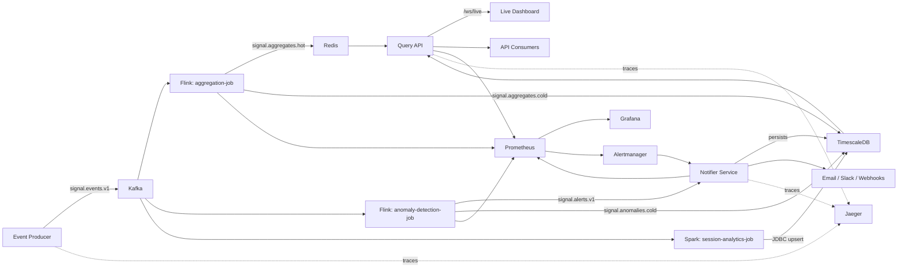

# Real-Time Signal Intelligence Platform

A production-style event streaming platform for real-time KPI tracking, multi-detector anomaly detection, session/funnel analytics, and low-latency APIs over hot and cold storage.

[](https://www.python.org/)
[](https://kafka.apache.org/)
[](https://flink.apache.org/)
[](https://spark.apache.org/)
[](https://fastapi.tiangolo.com/)
[](https://redis.io/)
[](https://www.timescale.com/)
[](https://www.docker.com/)
[](https://kubernetes.io/)
[](https://prometheus.io/)
[](https://grafana.com/)
[](https://opentelemetry.io/)

## Why this exists

Product and platform teams need to answer three questions about their event traffic in real time: *what is happening right now* (hot KPIs), *is anything unusual* (anomaly detection), and *what did a user actually do* (session/funnel reconstruction). Most reference streaming projects only do the first two. This platform does all three, end to end, on top of the tools teams already run in production: Kafka, Flink, Spark, Redis, TimescaleDB, Prometheus, and Grafana.

## Impact / benchmarks

**Measured today:** the producer's generate → validate → serialize path
sustains ~7,000 events/sec single-threaded on a 2 vCPU machine (no Kafka
connection — that's the CPU-bound part of the pipeline in isolation). See
[`docs/BENCHMARKS.md`](docs/BENCHMARKS.md) and
[`loadtests/results/producer-benchmark.json`](loadtests/results/producer-benchmark.json)
for the methodology, the raw numbers, and how to reproduce them
(`python scripts/benchmark_producer.py`).

**Design targets, not yet measured end-to-end** (the tooling to measure
them — `loadtests/k6-scripts/`, `scripts/check-system-status.sh` — ships in
this repo; running it against a live stack and checking in the result is
tracked in `docs/BENCHMARKS.md`):

- 5,000+ events/sec sustained through the full pipeline (producer → Kafka → Flink → Redis/TimescaleDB)
- p95 query-api read latency under 150ms for hot aggregates

**What's actually built and running today:**

- Three independent anomaly detectors (rolling z-score, MAD, EWMA) reduce false negatives on both sudden spikes and slow drift
- Reconstructs user sessions and purchase-funnel progress from the same event stream, with no separate ingestion path
- Observability-first: every service exports Prometheus metrics and OpenTelemetry traces (Jaeger), and two provisioned Grafana dashboards ship out of the box
- Schema-validated Kafka contracts with dead-letter-queue routing for anything that doesn't match (see [`schemas/README.md`](schemas/README.md))

## Architecture



Dashed lines are OpenTelemetry traces (Prometheus/Grafana on the solid lines are metrics — two different observability signals feeding two different backends). Malformed messages on `signal.events.v1`/`signal.alerts.v1` are routed to `signal.events.dlq`/`signal.alerts.dlq` rather than dropped or crashing a consumer — see [`schemas/README.md`](schemas/README.md) (not shown on the diagram to keep it readable).

See [`docs/ARCHITECTURE.md`](docs/ARCHITECTURE.md) for the full design rationale, including why session reconstruction runs on Spark while per-event processing runs on Flink.

## Tech stack

| Layer | Technology |
|---|---|
| Streaming backbone | Apache Kafka |
| Per-event stream processing | Apache Flink (DataStream API, keyed state, sliding windows) |
| Session/batch stream processing | Apache Spark (Structured Streaming, session windows) |
| Hot storage | Redis |
| Cold storage | TimescaleDB (PostgreSQL + time-series extension) |
| APIs | Python, FastAPI, WebSockets |
| Observability | Prometheus, Grafana, Alertmanager, OpenTelemetry, Jaeger |
| Data contracts | JSON Schema, dead-letter-queue topics |
| Infrastructure | Docker Compose, Kubernetes, Helm, Terraform (reference IaC, see `infra/terraform/`) |
| Load/perf testing | k6 |
| CI/CD | GitHub Actions |

## Core features

- **Synthetic event producer** generating realistic, source-correlated telemetry at a configurable rate (`ingestion/event-producer`)
- **Sliding-window KPI aggregation** (count, avg, p95, p99, error rate) per source, refreshed every 10 seconds over a 1-minute window (`streaming-jobs/aggregation-job`)
- **Three-detector anomaly detection** — rolling z-score, median absolute deviation (MAD), and EWMA — scored per event with keyed Flink state (`streaming-jobs/anomaly-detection-job`)
- **Session & funnel reconstruction** using Spark session windows, tracking how far each session got through a 5-step funnel and whether it converted (`streaming-jobs/session-analytics-job`)
- **Query API** serving hot KPIs (Redis), historical series and sessions (TimescaleDB), anomaly history, and a WebSocket live feed (`services/query-api`)
- **Notifier service** with rule-based cooldowns and real email/Slack/webhook dispatch, plus Alertmanager webhook ingestion (`services/notifier-service`)
- **Live dashboard** — a build-free, single-page visualization of the WebSocket feed (`services/live-dashboard`)
- **Full observability stack**: Prometheus scraping every service (via purpose-built exporters for Kafka/Redis/Postgres), OpenTelemetry distributed tracing exported to Jaeger, structured JSON logging with request/message correlation IDs, two provisioned Grafana dashboards, and Alertmanager routing (see [`docs/OBSERVABILITY.md`](docs/OBSERVABILITY.md))
- **Data contracts and dead-letter queues**: every Kafka message is validated against a JSON Schema before it's trusted; anything that fails is routed to a DLQ topic with the failure reason attached instead of being dropped or crashing a consumer (see [`schemas/README.md`](schemas/README.md), [`scripts/dlq_inspect.py`](scripts/dlq_inspect.py))
- **Docker Compose** for one-command local development, a **Helm chart** with real Kubernetes templates (Deployments, Services, HPA, Ingress) for cluster deployment, and a **Terraform** reference architecture (`infra/terraform/`) matching `docs/COST.md`'s sizing tiers

## Project structure

```text
.
├── ingestion/               # Event producer (Kafka)
├── streaming-jobs/          # Flink (aggregation, anomaly detection) + Spark (sessions)
├── services/                # query-api, notifier-service, live-dashboard
├── schemas/                 # Canonical JSON Schema data contracts (see schemas/README.md)
├── infra/                   # Docker Compose, Helm chart, Terraform reference IaC
├── loadtests/                # k6 performance tests + checked-in results
├── docs/                     # Architecture, API, database, observability, benchmarks, deployment docs
├── scripts/                  # Local dev, job submission, health check, load test, DLQ, benchmark scripts
└── .github/workflows/        # CI/CD pipeline
```

## Getting started

### Prerequisites

- Docker and Docker Compose (v2)
- Python 3.11+
- Java 11 + Maven, to build the Flink/Spark job JARs
- `k6`, if you want to run the load tests

### Local development

```bash
git clone https://github.com/YOUR_GITHUB_USERNAME/realtime-signal-intelligence-platform.git
cd realtime-signal-intelligence-platform

./scripts/setup-local-dev.sh
```

This builds the streaming-job JARs, brings up the full docker-compose stack (Kafka, Redis, TimescaleDB, Flink, Spark, Prometheus, Grafana, and all four application services), creates the Kafka topics, and submits the streaming jobs. See [`docs/DEPLOYMENT.md`](docs/DEPLOYMENT.md) for the manual, step-by-step version and for Kubernetes/Helm instructions.

### Useful local endpoints

| Service | URL |
|---|---|
| Query API docs | http://localhost:8000/docs |
| Live dashboard | http://localhost:8003 |
| Grafana | http://localhost:3000 (`admin` / `admin`) |
| Prometheus | http://localhost:9090 |
| Kafka UI | http://localhost:8080 |
| Flink dashboard | http://localhost:8081 |
| Spark master UI | http://localhost:8082 |
| Jaeger (traces) | http://localhost:16686 |

## API surface

Full reference in [`docs/API.md`](docs/API.md). Highlights:

- `GET /health`, `GET /ready` — liveness/readiness
- `GET /kpi?source=web&window=1m` — hot aggregate reads from Redis
- `GET /series?source=web&from=...&to=...&aggregation=avg` — historical time-series reads from TimescaleDB
- `GET /alerts?since=...&severity=critical` — anomaly alert history
- `GET /sessions?source=web&converted_only=true` — reconstructed sessions and funnel progress
- `WS /ws/live` — pushes a KPI + recent-alert snapshot every 2 seconds
- `GET /metrics` — Prometheus scrape endpoint

## Database

See [`docs/DATABASE.md`](docs/DATABASE.md) for the full TimescaleDB schema (`events_raw`, `metrics_1min`, `anomalies`, `sessions`), retention/compression policies, and the Redis key layout.

## Testing

```bash
# Python services
cd services/query-api && pip install -r requirements-dev.txt && pytest tests/unit
cd services/notifier-service && pip install -r requirements-dev.txt && pytest tests/unit
cd ingestion/event-producer && pip install -r requirements-dev.txt && pytest tests/unit
# tests/integration in each service requires a live Redis/TimescaleDB (see infra/docker-compose)

# Streaming jobs (JUnit, no cluster required — tests the aggregation/anomaly
# logic directly)
cd streaming-jobs/aggregation-job && mvn test
cd streaming-jobs/anomaly-detection-job && mvn test

# Helm chart (renders offline, no cluster needed)
helm lint infra/helm/signal-intel-platform
helm template signal-intel infra/helm/signal-intel-platform

# Load tests
./scripts/run-load-tests.sh

# Producer micro-benchmark (see docs/BENCHMARKS.md)
python scripts/benchmark_producer.py --events 50000
```

## Deployment

See [`docs/DEPLOYMENT.md`](docs/DEPLOYMENT.md) for Docker Compose, Kubernetes/Helm, and CI/CD details, and [`docs/SECURITY.md`](docs/SECURITY.md) / [`docs/COST.md`](docs/COST.md) for hardening and sizing guidance.

## What this demonstrates

- Real-time, event-driven distributed systems design across two different stream-processing engines chosen for the shape of the workload
- Multi-detector anomaly detection and the tradeoffs between rolling-window and exponentially-weighted approaches
- Low-latency API design layered over both hot (in-memory) and cold (time-series) storage, plus a WebSocket push model
- Production-style observability: metrics, distributed tracing, structured/correlated logs, dashboards, alert routing, and notification delivery, not just log lines
- Data contract discipline: schema-validated Kafka messages with dead-letter-queue routing, instead of trusting every consumer to defensively parse whatever shows up
- Infrastructure-as-code across Docker Compose (dev), Helm/Kubernetes (cluster), and a Terraform reference architecture (cloud), with a CI/CD pipeline that lints the Helm chart, builds, tests, scans, and deploys

## Known limitations & honest next steps

This is a portfolio-grade platform, not a hardened production deployment. Before running this anywhere with real traffic or real user data:

- Kafka and TimescaleDB run single-broker/single-node in docker-compose — no replication, no failover rehearsed
- The API-key auth on query-api is a shared-secret header, not a real identity provider; put a proper auth layer (OAuth2/JWT via an API gateway) in front of it for anything beyond a demo
- Kafka is unauthenticated (`PLAINTEXT`) in docker-compose; enable SASL/SSL per `docs/SECURITY.md` before exposing it beyond a local network
- The Helm chart's default `values.yaml` ships placeholder credentials (`password`, `change-me-in-production`) that **must** be overridden via a real secret manager before any non-local deploy
- There is no automated schema-migration tool (e.g. Alembic/Flyway) — `01-init-timescaledb.sql` is applied once at first container start; evolving the schema later needs a real migration story
- OpenTelemetry trace context is propagated Python-service-to-Python-service and producer-to-Kafka-header, but the Flink/Spark (JVM) streaming jobs don't yet read or forward it — a trace currently ends at the Kafka write and a new one starts wherever a Python service reads the data back out (see `tracing.py` in any service for detail)
- `infra/terraform/` is a reference architecture matching `docs/COST.md`'s sizing tiers, written but not applied against a real AWS account in this environment — run `terraform validate`/`plan` and review every default before applying it anywhere
- The JSON Schema data contracts in `schemas/` are duplicated into each service's own directory rather than imported from one shared package, because each service builds from an independent Docker context — see `schemas/README.md` for the tradeoff and what a larger monorepo would do differently

See [`docs/ARCHITECTURE.md`](docs/ARCHITECTURE.md) for the reasoning behind these tradeoffs and what a hardened version would add.

## License

[MIT](LICENSE)
