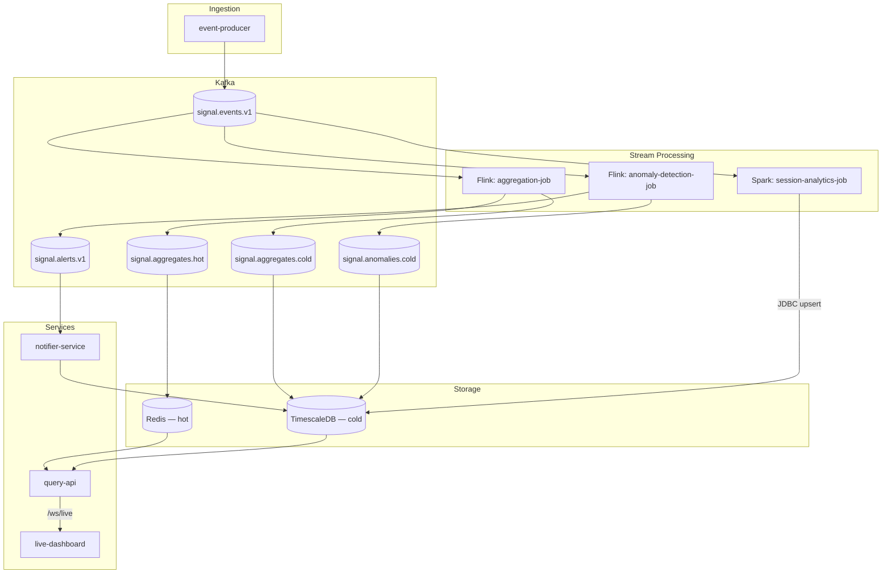

# Architecture

## Overview

The platform is a set of independently deployable services connected by Kafka. Nothing calls anything else synchronously except the query-api's own reads from Redis/TimescaleDB and the live-dashboard's WebSocket connection to query-api — every other hop is a Kafka topic. That means any single component can fail, restart, or be scaled independently without taking the rest of the pipeline down; consumers pick up where they left off via consumer-group offsets.

## Why two stream-processing engines

Both Flink jobs are per-event, low-latency processors: they see one event, update some keyed state (a sliding window accumulator, or a rolling-statistics buffer), and emit a result — sub-second is the goal. Flink's DataStream API with keyed state and event-time windows is built exactly for that shape of problem.

Session reconstruction is a different shape entirely: it needs to group *many* events that arrive over a *long* span of wall-clock time (up to the 30-minute inactivity gap that closes a session) into *one* output row per session, and that row needs to be revised as more events for the same session arrive. Spark Structured Streaming's native `session_window` primitive does exactly this — it is the tool built for many-to-one, gap-based grouping, whereas Flink's session windows would require hand-rolled process functions to get the same upsert-on-update behavior this job needs. Using the tool that matches the workload, rather than forcing one engine to do both jobs, is the point — a real platform team choosing between Flink and Spark for a given job would make the same call.

## Why Kafka topics instead of direct writes

The aggregation and anomaly jobs don't write to Redis/TimescaleDB directly from Flink — they publish formatted messages to intermediate topics (`signal.aggregates.hot`, `signal.aggregates.cold`, `signal.anomalies.cold`) that downstream consumers write into the actual stores. This keeps the Flink jobs free of database client dependencies and connection-pool management (which is a poor fit for a distributed, horizontally-scaled DataStream job), and it means a consumer outage doesn't back-pressure the stream processor — messages simply queue in Kafka until the consumer catches up. The session-analytics job is the one exception: it upserts directly into TimescaleDB via `foreachBatch`, because each Spark micro-batch needs a single atomic upsert transaction per session row, which is a natural fit for Spark's batch-oriented sink model and awkward to route through an extra topic hop.

## Why Redis *and* TimescaleDB

Redis serves the `/kpi` hot path: callers asking "what's happening right now" get an answer in single-digit milliseconds because it's a key lookup against data the aggregation job refreshed 10 seconds ago at most, with a 1-hour TTL so stale keys expire on their own. TimescaleDB serves `/series`, `/alerts`, and `/sessions`: anything that needs a time-range scan, an aggregation across many rows, or has to survive longer than an hour. Trying to serve both patterns from one store means picking one of two bad tradeoffs — either read replicas and heavy caching in front of Postgres to hit hot-path latency targets, or losing TimescaleDB's compression/retention/continuous-aggregate features by keeping everything in Redis. Splitting them keeps each store doing what it's good at.

## Service responsibilities

| Service | Responsibility | Talks to |
|---|---|---|
| `event-producer` | Generates synthetic telemetry at a configurable rate | Kafka (producer) |
| `aggregation-job` (Flink) | 1-minute sliding-window KPIs per source | Kafka (consumer + producer) |
| `anomaly-detection-job` (Flink) | Per-event anomaly scoring (z-score, MAD, EWMA) with keyed rolling state | Kafka (consumer + producer) |
| `session-analytics-job` (Spark) | Session/funnel reconstruction via session windows | Kafka (consumer), TimescaleDB (JDBC) |
| `query-api` | Public read API + WebSocket live feed | Redis, TimescaleDB |
| `notifier-service` | Alert rules/cooldowns, persistence, multi-channel notification dispatch | Kafka (consumer), TimescaleDB, SMTP/Slack/webhooks |
| `live-dashboard` | Serves the live-feed visualization | query-api (WebSocket) |

## Configuration & state management

Every service is configured entirely through environment variables (see each service's `config.py` or the `System.getenv()` calls in the Java jobs), with defaults that match the docker-compose stack. There is no shared config file and no service discovery beyond DNS names within the Docker/Kubernetes network — the same container images run unmodified in docker-compose, Helm, and local development. Application state lives in exactly three places: Kafka (the event log and inter-job messaging), Flink's own keyed state (rolling statistics for anomaly detection, checkpointed to the configured state backend for fault tolerance), and the two persistent stores (Redis, TimescaleDB). No service holds authoritative state in process memory that isn't recoverable from one of those three places, other than the notifier-service's alert-cooldown map, which is intentionally best-effort (a restart just means one extra notification might fire for an alert still in its cooldown window — a deliberate tradeoff of simplicity over exactness for a non-critical dedup mechanism).

## Deliberate tradeoffs (and what to change for a hardened deployment)

See the "Known limitations & honest next steps" section in the root [`README.md`](../README.md) for the specific list (single-broker Kafka, shared-secret API auth, unauthenticated Kafka listeners, placeholder Helm secrets, no schema-migration tool). Each of those is a reasonable choice for a local/demo deployment and a real gap for production — the README calls them out explicitly rather than leaving them implicit.
